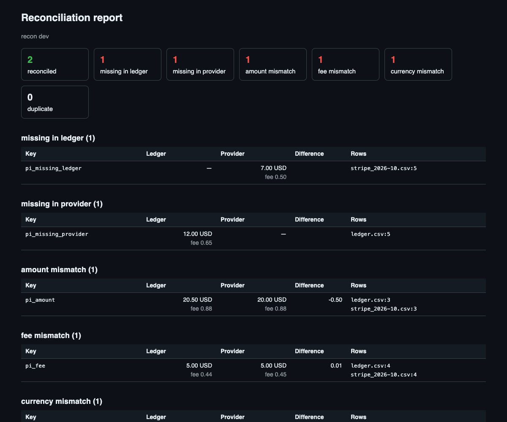

# recon

[](https://github.com/IanFoxDev/recon/actions/workflows/go.yml)
[](https://github.com/IanFoxDev/recon/actions/workflows/examples.yml)

Reconciles your ledger with a payment provider's export. A SQL query against your
database on one side, the provider's CSV on the other, matching rules in YAML, and a
report of every payment that does not add up.

Reconciliation is often a script someone runs by hand, and its output is read when
finance asks why the numbers differ. recon is meant to run every morning or in CI: one
container, one config file, an exit code that says whether everything reconciled.

> Status: in development, nothing released yet.

## Quick start

```yaml
# recon.yaml
version: 1
ledger:
  sql:
    dsn_env: LEDGER_DSN
    query: select psp_reference, amount_minor, fee_minor, currency from payments
  columns: {key: psp_reference, amount: amount_minor, fee: fee_minor, currency: currency}
provider:
  csv: {path: exports/stripe_*.csv, profile: stripe_balance}
  columns: {key: payment_intent_id}
  filter:
    - {column: reporting_category, in: [charge]}
report:
  html: out/report.html
  json: out/report.json
```

```bash
docker run --rm -v "$PWD:/work" -e LEDGER_DSN=postgres://ro:ro@db/shop ghcr.io/ianfoxdev/recon run -c /work/recon.yaml
```

```
reconciled 200, differences 12, missing_in_ledger 2, missing_in_provider 2, amount_mismatch 2, fee_mismatch 2, currency_mismatch 2, duplicate 2
```

The exit code is 0 when everything reconciles, 1 when there are differences and 2 when
the run failed (a bad config, a file that cannot be read, a malformed amount).



## What it finds

| Category | Meaning |
|---|---|
| `missing_in_ledger` | The provider has a payment your ledger does not: money arrived and nobody booked it |
| `missing_in_provider` | Your ledger has a payment the provider does not: you booked money that never came |
| `amount_mismatch` | Both have it, the amounts differ (beyond the tolerance, exact by default) |
| `fee_mismatch` | Both have it, the provider charged a different fee than you booked |
| `currency_mismatch` | The same reference in two currencies; amounts in different currencies are never added or compared |
| `duplicate` | One side has the reference more than once (unless rows are grouped, see below) |

Each difference names the file and line, or the row number of the query, of every row
behind it.

## Money and repeatability

Amounts are integers in minor units from the file to the report. A decimal string is
parsed digit by digit using the currency's exponent from ISO 4217, so `"10.99"` USD is
1099 and `"1100"` JPY is 1100. A value with more decimals than the currency has
(`"10.999"` EUR) stops the run with the file, line and column; it is never rounded.
Database values are read as text, so a `numeric` column never passes through a float.

The same input gives the same report, byte for byte. The report records the SHA-256 of
every input file and contains no clock unless you pass `--stamp`.
Why: [docs/adr/0001-money-and-determinism.md](docs/adr/0001-money-and-determinism.md).

## Sources and formats

- `sql`: PostgreSQL, read-only. The DSN comes from an environment variable, never from
  the file.
- `csv`: one file or a glob. Delimiter, decimal and thousands separators are set per
  source.
- `profile: stripe_balance`: Stripe's itemized Balance report
  (`balance_change_from_activity.itemized`), `gross` and `fee` in major units. You
  choose the key: `payment_intent_id`, `charge_id` or `source_id`.

One payment at the provider booked as several rows in your ledger: set
`match.group: true` and rows with the same key are summed on each side before they are
compared.

The full configuration: [docs/config.md](docs/config.md).

## Example

[examples/stripe](examples/stripe) runs recon in docker compose against a PostgreSQL
ledger and a Stripe export generated with known differences. CI checks that the report
lists exactly those.

## Not yet

Scheduling and notifications (run it from cron or CI), a web UI, bank formats
(CAMT.053, MT940), MySQL, date tolerances and settlement checks. If you need one of
these first, open an issue.

## Contributing

A new export format is the most useful contribution: open an issue with the "Export
format" template and two made-up rows. See [CONTRIBUTING.md](CONTRIBUTING.md).

## License

[MIT](LICENSE)
